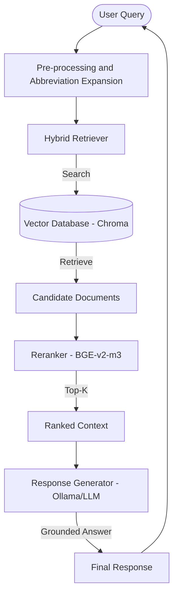

# University Academic Regulations RAG

**Retrieval-Augmented Question Answering System for University Policies**

This project implements a state-of-the-art **Retrieval-Augmented Generation (RAG)** system designed to provide accurate, grounded answers to questions regarding university academic regulations (quy định học vụ). By using official policy documents as its primary knowledge source, the system minimizes hallucinations and ensures high-fidelity responses.

---

## Key Features

- **Hybrid Retrieval Strategy**: Combines semantic search (BGE-M3) with metadata filtering and re-ranking for superior accuracy.
- **Context-Aware Generation**: LLM-powered answers strictly grounded in retrieved document chunks.
- **Vietnamese Language Support**: Optimized for university-specific terminology and Vietnamese academic context.
- **Professional Web Interface**: Sleek, modern chat interface for seamless user interaction.
- **Evaluation-Driven**: Performance tracked using RAGAS metrics (Faithfulness, Precision, Recall, Correctness).
- **CI/CD Ready**: Fully containerized with GitHub Actions for automated deployment to Azure.

---

## Architecture

The system follows a modular RAG architecture:



---

## Installation & Setup

### 1. Prerequisite: Ollama
The system uses [Ollama](https://ollama.com/) to host LLMs locally or in the cloud.
1. Install Ollama.
2. Pull the required models:
   ```bash
   ollama pull deepseek-v3.1:671b-cloud
   ```

### 2. Local Setup
```bash
# Clone the repository
git clone https://github.com/DiamondHoang/University-academic-regulations-rag.git
cd University-academic-regulations-rag

# Install dependencies
pip install -r requirements.txt

# Run the server
python server.py
```
Access the UI at `http://localhost:8000`.

### 3. Docker Setup
```bash
# Using Docker Compose
docker-compose up --build
```

---

## Configuration

The system is configured via environment variables (see `config.py` for details):

| Variable | Description | Default |
| :--- | :--- | :--- |
| `LLM_MODEL` | The LLM to use for generation | `deepseek-v3.1:671b-cloud` |
| `OLLAMA_BASE_URL` | URL for the Ollama server | `http://localhost:11434` |
| `DB_PATH` | Path to persist the Vector DB | `vector_db` |
| `EMBEDDING_MODEL` | HuggingFace embedding model | `BAAI/bge-m3` |
| `BASE_PATH` | Directory containing source MD files | `md` |

---

## Evaluation & Model Comparison

Evaluation was conducted using **RAGAS metrics** on a curated QA dataset:

| Model | Faithfulness | Context Precision | Context Recall | Answer Correctness |
| :--- | :--- | :--- | :--- | :--- |
| **DeepSeek v3.1** | 0.8682 | 0.7550 | **0.8733** | **0.7992** |
| **GPT-OSS** | **0.8990** | **0.7683** | 0.8533 | 0.7157 |
| **Qwen3 Coder** | 0.8962 | 0.7533 | **0.8733** | 0.7417 |

---

## Project Structure

- `server.py`: FastAPI server and session management.
- `uni_rag.py`: Core RAG logic and pipeline orchestration.
- `config.py`: Centralized configuration and regex patterns.
- `retrieval/`: Hybrid retrieval and response generation modules.
- `loader/`: Document loading and pre-processing utilities.
- `index.html`: Modern web-based chat interface.
- `md/`: Source knowledge base (academic regulations in Markdown).

---

## Cloud Deployment

For detailed instructions on deploying to Azure using the provided GitHub Actions, see [AZURE_SETUP.md](AZURE_SETUP.md).

---


