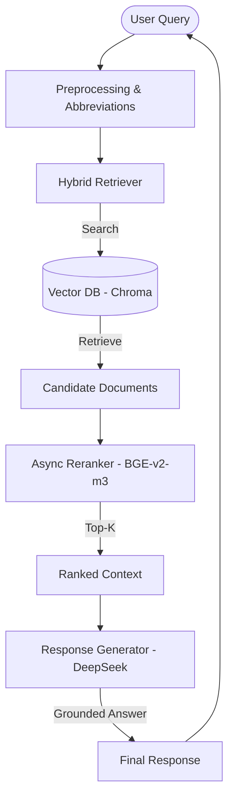

# University Academic Regulations RAG

**Retrieval-Augmented Question Answering System for University Policies**

This project implements a high-performance **Retrieval-Augmented Generation (RAG)** system built to provide accurate, grounded answers regarding university academic regulations (quy định học vụ). 

---

## Key Features

- **Optimized Retrieval**: Uses BGE-M3 for semantic search with threaded re-ranking for maximum speed and accuracy.
- **Context-Aware Generation**: Responses are strictly grounded in official documents to ensure reliability.
- **High Performance**: 
  - **Threaded Re-ranking**: CPU-intensive re-ranking runs in parallel to keep the server responsive.
  - **Fast Retrieval**: Optimized candidate selection to reduce latency.
- **Vietnamese Language Support**: Tailored for Vietnamese academic terminology and document structures.
- **Modern Web Interface**: Intuitive and responsive chat UI.
- **CI/CD Ready**: Containerized with Docker and GitHub Actions for automated deployment.

---

## Architecture

The system follows a modular RAG architecture:



---

## Installation & Setup

### 1. Prerequisite: Ollama
1. Install [Ollama](https://ollama.com/).
2. Pull the required models:
   ```bash
   ollama pull deepseek-v3.1:671b-cloud
   ```

### 2. Quick Start
```bash
# Install dependencies
pip install -r requirements.txt

# Start the server
python server.py
```
Access the chat interface at `http://localhost:8000`.

### 3. Docker Deployment
```bash
docker-compose up --build
```

---

## Configuration

Settings can be adjusted in `config.py`:

| Variable | Description | Default |
| :--- | :--- | :--- |
| `LLM_MODEL` | AI Model for generation | `deepseek-v3.1:671b-cloud` |
| `TOP_K_RERANK` | Number of documents to re-rank | `12` |
| `MAX_RESPONSE_DOCS` | Sources cited in response | `4` |
| `DB_PATH` | Vector database storage | `vector_db` |

---

## Project Structure

- `server.py`: FastAPI server with async lifespan management.
- `uni_rag.py`: RAG pipeline orchestration.
- `retrieval/`: Search and response generation modules.
- `loader/`: Document parsing and cleaning.
- `md/`: Knowledge base (Markdown files).
- `index.html`: Web chat interface.

---

## Cloud Deployment

See [AZURE_SETUP.md](AZURE_SETUP.md) for instructions on deploying to Azure.


