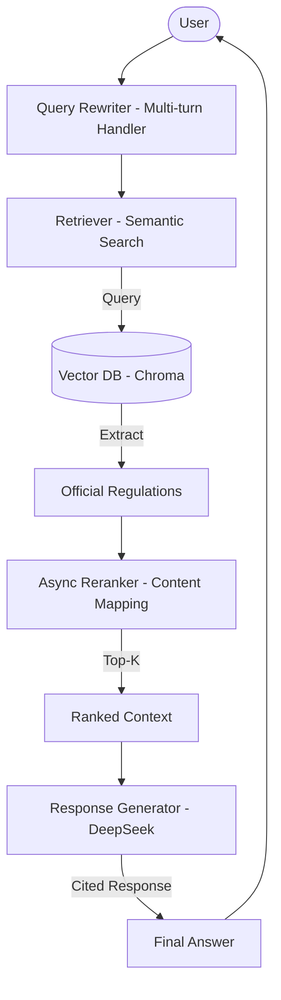

# HCMUT Academic Regulations Chatbot

**An intelligent RAG system for navigating academic policies at Ho Chi Minh City University of Technology (HCMUT).**

Experience it now at: [https://regulationchatbot-gxfrfxffdufyh6e6.eastasia-01.azurewebsites.net](https://regulationchatbot-gxfrfxffdufyh6e6.eastasia-01.azurewebsites.net)

---

## Introduction

Navigating complex academic regulations at HCMUT has never been easier. This product is not just a standard keyword search tool; it is a **professional AI assistant** that deeply understands official university documents to provide accurate, grounded, and clearly cited answers for students and faculty.

### Key Highlights:
- **Follow-up Question Support**: Chat naturally as you would with a human. If you ask "What are the scholarship requirements?" followed by "What about undergraduate students?", the chatbot understands the context of the first question to provide a precise follow-up answer.
- **Accurate Citations**: Every answer includes source tags like [1], [2]..., referencing official documents directly.
- **Recency Awareness**: The system automatically prioritizes the most recently issued regulations, ensuring you always get the latest information.

---

## Core Technologies

The system is built on a modern RAG pipeline:

- **LLM**: Powered by DeepSeek for advanced reasoning and natural language processing.
- **Embedding & Retrieval**: Utilizes BGE-M3 for deep semantic understanding, going beyond simple keyword matching.
- **Re-ranking**: Cross-Encoder models refine search results, ensuring the most relevant context is prioritized for generation.
- **Frontend**: A sleek, modern, and responsive chat interface.

---

## System Architecture



---

## Local Setup (For Developers)

To run the system locally:

1. **Prerequisites**: Install [Ollama](https://ollama.com/) and pull the required models.
2. **Install Dependencies**:
   ```bash
   pip install -r requirements.txt
   ```
3. **Run the Server**:
   ```bash
   python server.py
   ```
Access the interface at: `http://localhost:8000`

---

## Related Documents
- [Azure Setup Guide](AZURE_SETUP.md)
- [System Configuration](config.py)

---


